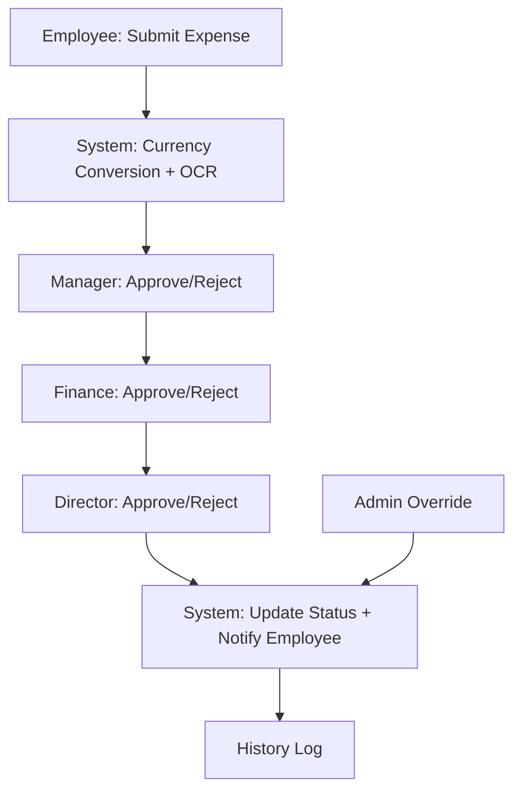

# 💸 Expense Management System

## 📌 Problem Statement
Companies often face challenges with **manual expense reimbursement processes**:
- Time-consuming & error-prone.
- No transparency for employees.
- Hard to manage **multi-level approvals**.
- Lack of **flexible approval rules**.

This project solves these issues with a **smart, automated expense management system**.

---

## 🚀 Core Features

### 🔐 Authentication & User Management
- On signup → Company profile (with country currency) & Admin auto-created.
- Admin can:
  - Add employees & managers.
  - Assign/change roles.
  - Define manager-employee relationships.

### 🧾 Expense Submission (Employee Role)
- Employees can:
  - Submit expenses (amount, category, date, description, currency).
  - Upload receipts → OCR auto-fills details.
  - View expense history (approved/rejected).

### ✅ Approval Workflow (Manager/Admin)
- Multi-level approval flow:
  - Example: Manager → Finance → Director.
- Managers can approve/reject with comments.
- Expenses move step by step until final decision.

### ⚖️ Conditional Approval Rules
- **Percentage Rule** → e.g., 60% of approvers approve → Expense approved.
- **Specific Approver Rule** → e.g., CFO approves → Auto-approved.
- **Hybrid Rule** → Combine both (60% OR CFO approves).

### 🧑‍💼 Role Permissions
- **Admin**
  - Create/manage company.
  - Manage users, roles, and approval rules.
  - View all expenses.
  - **Override approvals** (bypass workflow if required).
- **Manager**
  - Approve/reject team expenses.
  - View team history.
  - Escalate cases as per rules.
- **Employee**
  - Submit expenses.
  - Track their own expense status.

### 🌍 Currency Handling
- Auto currency conversion using APIs:
  - Countries & Currencies → [REST Countries API](https://restcountries.com/v3.1/all?fields=name,currencies)
  - Conversion → [Exchange Rate API](https://api.exchangerate-api.com/v4/latest/{BASE_CURRENCY})

---

## 🖼️ Example Workflow
1. Employee submits an expense (can be in foreign currency).  
2. System converts currency & logs expense.  
3. Approval chain: Manager → Finance → Director.  
4. Final status notified to employee.  
5. Admin can override at any point.

---

## 📊 Workflow Diagram

---

## ✨ Additional Features
- OCR receipts → Auto-generated expense fields.
- Transparent history & tracking.
- Flexible workflows (sequential + conditional).

---

## 📌 Mockups
- [Excalidraw Design Mockup](https://link.excalidraw.com/l/65VNwvy7c4X/4WSLZDTrhkA)

---

## ⚡ Summary
This system makes expense management:
- **Faster** (OCR, automation).  
- **Transparent** (history + notifications).  
- **Flexible** (multi-level + conditional workflows).  
- **Controlled** (admin override).  

